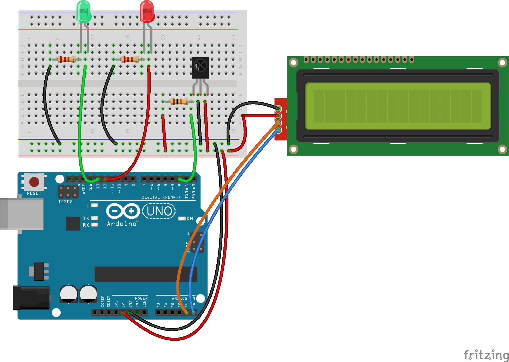

# Arduino_IR_LCD
##  1. IRremote + LCD
- 적외선 리모콘과 LCD, LED를 활용해 간단한 모듈을 만들어 보겠습니다. 
- [적외선 리모콘](https://refree.github.io/text/) 과 [LCD](https://refree.github.io/arduino_LCD/)를 참고해주세요~

## 2. Hardware Setting
- 언제나 그러하듯, 저는 회로부터 설계합니다. 
  `IRremote`와 `LiquidCrystal_I2C`를 함께 배치하고, LED는 저항과 함께 세팅합니다. 
<br>
<p align="center">
	
</p>


## 3. Software Coding
#### Library 다운
> 스케치 실행 - 툴 - 라이브러리 관리 - `IRremote` 검색 & 다운
> 스케치 실행 - 툴 - 라이브러리 관리 - `LiquidCrystal_I2C` 검색 & 다운
> 중간에 나와요~

### Sketch Coding
```
#include <Wire.h> 
#include <LiquidCrystal_I2C.h>
#include <IRremote.h>
int input_pin = 2; //입력핀의 설정


IRrecv irrecv(input_pin); //IRrecv 객체생성
decode_results signals;  //수신 데이터 저장 구조체
LiquidCrystal_I2C lcd(0x27,16,2);


void setup()
{
  lcd.init();                      // LCD 초기화
  lcd.backlight();                 // LCD 백라이트 On
  Serial.begin(9600);             //시리얼모니터
  irrecv.enableIRIn();           //수신시작
  pinMode(13, OUTPUT);           // LED 출력 설정 
  pinMode(12, OUTPUT);           // LED 출력 설정
}
  
void loop() {
//수신되는 내용이 있을 경우만 시리얼모니터에 표시함  
if (irrecv.decode(&signals)) //수신을 받으면
   {   
     if (signals.decode_type == NEC) // NEC 포맷의 IR신호
       {   
         switch (signals.value) // 수신한 값을 각 case와 비교
         {
          case 0x00FF6897:  //key 0
          Serial.println("key id 0");
          digitalWrite(13, HIGH);         // 초록색 LED 켜기
          lcd.setCursor(0,0);            // 0번째 줄 0번째 칸에
          lcd.print("Green");           // Green 이라고 LCD에 출력하기(동영상이랑 조금 달라요!)
          break;
          
          case 0x00FF30CF:  //key 1
          Serial.println("key id 1");
          digitalWrite(12, HIGH);         // 붉은색 LED 켜기
          lcd.setCursor(0,1);            // 1번째 줄 0번째 칸에
          lcd.print("Red");             // Green 이라고 LCD에 출력하기(동영상이랑 조금 달라요!)
          break;

          case 0x00FF18E7:  //key2
          Serial.println("key id 2");
          digitalWrite(13, LOW);      // LED 끄기
          digitalWrite(12, LOW);      // LED 끄기
          lcd.clear();                // LCD 클리어
          break;
          
         default:
         break;
         }
       }
      irrecv.resume(); //다음값 수신
    }
}
}


```

<!-- [](https://youtu.be/qxe3xkCqmlQ) -->
